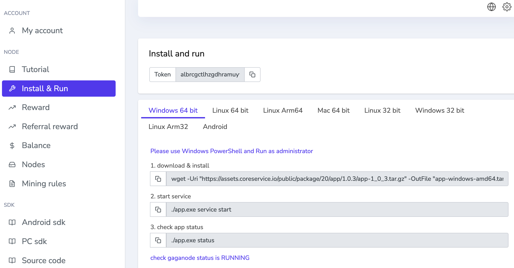

# How To Run GaGa On ARM

>How to easily install a GaGaNode on ARM.

[[toc]]

## Supported Unix/Linux operating systems

|OS|Website|
|:-:|:-:|
|Ubuntu|[https://ubuntu.com/download/server/arm](https://ubuntu.com/download/server/arm)|
|Debian|[https://www.debian.org/ports/arm](https://www.debian.org/ports/arm/)|
|Raspberry Pi OS|[https://www.raspberrypi.com/software](https://www.raspberrypi.com/software/)|
|Fedora|[https://arm.fedoraproject.org](https://arm.fedoraproject.org/)|
|OpenWrt|[https://openwrt.org](https://openwrt.org)|
|Armbian|[https://www.armbian.com](https://www.armbian.com)|
|DietPi|[https://dietpi.com](https://dietpi.com/)|
|Manjaro|[https://manjaro.org/download/#ARM](https://manjaro.org/download/#ARM)|
|Arch Linux|[https://archlinuxarm.org](https://archlinuxarm.org/about/downloads)|
|openSUSE|[https://get.opensuse.org](https://get.opensuse.org)|
|Asahi Linux|[https://asahilinux.org](https://asahilinux.org)|

## Register

[https://dashboard.gaganode.com/register](https://dashboard.gaganode.com/register)


Click the button “[Install & Run](https://dashboard.gaganode.com/install_run)” and you can find out your token and installation tutorial in this page.



## 1.Download & Install

<CodeGroup>

  <CodeGroupItem title="Linux ARM 64-bit">

```bash
curl -o app-linux-arm64.tar.gz https://assets.coreservice.io/public/package/24/app/1.0.3/app-1_0_3.tar.gz && tar -zxf app-linux-arm64.tar.gz && rm -f app-linux-arm64.tar.gz && cd ./app-linux-arm64 && sudo ./app service install
```

  </CodeGroupItem>

  <CodeGroupItem title="Linux ARM 32-bit">

```bash
curl -o app-linux-arm32.tar.gz https://assets.coreservice.io/public/package/23/app/1.0.3/app-1_0_3.tar.gz && tar -zxf app-linux-arm32.tar.gz && rm -f app-linux-arm32.tar.gz && cd ./app-linux-arm32 && sudo ./app service install
```

  </CodeGroupItem>

</CodeGroup>

Check the output of `uname -m`. If the result is `aarch32` you are running the ARM Linux kernel in `32-bit` and if the result is `aarch64` or `arm64` you are running the kernel in `64-bit` mode. check out [List of ARM processors](https://en.wikipedia.org/wiki/List_of_ARM_processors).

console output:

```bash
pi@raspberrypi:~ $ curl -o app-linux-arm64.tar.gz https://assets.coreservice.io/
public/package/24/app/1.0.3/app-1_0_3.tar.gz && tar -zxf app-linux-arm64.tar.gz 
&& rm -f app-linux-arm64.tar.gz && cd ./app-linux-arm64 && sudo ./app service in
stall                                                                           
  % Total    % Received % Xferd  Average Speed   Time    Time     Time  Current 
                                 Dload  Upload   Total   Spent    Left  Speed   
100 7241k  100 7241k    0     0  4061k      0  0:00:01  0:00:01 --:--:-- 4059k  
2022/12/13 04:51:20 [info] systemd detected                                     
Install app service:                                    [  OK  ]                
```

## 2.Start Service

```bash
sudo ./app service start
```

console output:

```bash
pi@raspberrypi:~/app-linux-arm64 $ sudo ./app service start                     
2022/12/13 04:51:31 [info] systemd detected                                     
Starting app service:                                   [  OK  ]                
```

## 3.Check APP Status

```bash
./app status
```

console output:

```bash
pi@raspberrypi:~/app-linux-arm64 $ ./app status                                 
[gaganode]:             local version:[1.0.3] latest version:[1.0.3] status:[TO_DOWNLOAD]                                                                       
```

## 4.Set Token

```bash
sudo ./apps/gaganode/gaganode config set --token=`your token`
```

console output:

```bash
pi@raspberrypi:~/app-linux-arm64 $ sudo ./apps/gaganode/gaganode config set --to
ken=`your token`                                                    
new config generated                                                            
restart for the new configuration to take effect                                    
```

## 5.Restart APP

```bash
./app restart
```

console output:

```bash
pi@raspberrypi:~/app-linux-arm64 $ ./app restart                                
restart command send, system will reboot...  
```

## Commands Reference

```bash
sudo ./app service install                    # install node
sudo ./app service start                      # start node
sudo ./app service stop                       # stop node
sudo ./app service remove                     # remove node
./app status                                  # check node running status
./app restart                                 # restart node
./app upgrade                                 # upgrade node
./app log                                     # check logs
./app -h                                      # check help
```